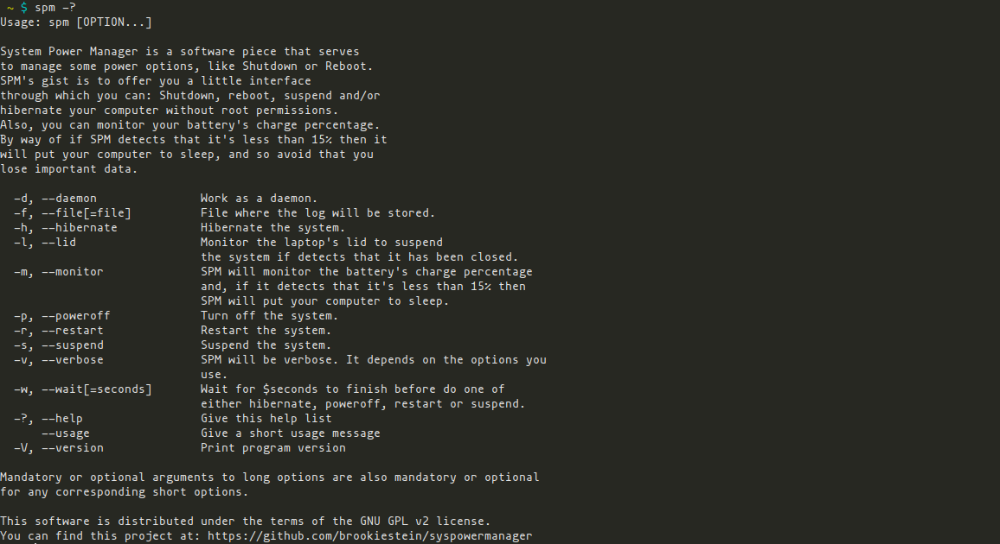

## System Power Manager
## Table of contents
- [System Power Manager](#system-power-manager)
- [Table of contents](#table-of-contents)
  - [What is System Power Manager?](#what-is-system-power-manager)
  - [What does it do?](#what-does-it-do)
  - [Why it exists?](#why-it-exists)
  - [Dependencies](#dependencies)
    - [How can I install the dependencies](#how-can-i-install-the-dependencies)
  - [Build and install](#build-and-install)
    - [Build](#build)
      - [Getting the sources](#getting-the-sources)
      - [Compilation](#compilation)
    - [Installation](#installation)
  - [Cleaning the work environment](#cleaning-the-work-environment)
  - [Run](#run)
  - [How can I use it on dwm](#how-can-i-use-it-on-dwm)
    - [Defining a constant](#defining-a-constant)
    - [Adding a keyboard shorcut for shutdown](#adding-a-keyboard-shorcut-for-shutdown)
    - [If you have a laptop computer](#if-you-have-a-laptop-computer)
      - [Define a constant](#define-a-constant)
      - [Adding a keyboard shortcut for sleep](#adding-a-keyboard-shortcut-for-sleep)
  - [Command line options](#command-line-options)
  - [Keyboard shortcuts](#keyboard-shortcuts)
  - [Note](#note)
  - [Some screenshots](#some-screenshots)

### What is System Power Manager?
System Power Manager (from now SPM) as its name suggests this program aims to manage some energy options.

### What does it do?
SPM can shutdown, reboot, hibernate (if your system allows it), and suspend your computer.
Also it can monitors your battery's charge percentage.
This latest, with the objective of put to sleep your computer if it has 15% or less.
So, avoid that you can lose your current work.

### Why it exists?
I have developed it for use on [dwm](https://github.com/brookiestein/dwm)
since it was very heavy open a terminal, enter the root password, etc., for do
things that shouldn't give much work perform, like shutdown or reboot the system, for example.

**Though it was made thinking in use on dwm, you can use it wherever!**

### Dependencies:
```
gcc
make
dbus
gtk3
elogind
glib (It's included on gtk)
```
#### How can I install the dependencies?
Depending of your distribution use the corresponding command:
| Distribution                     | Command                                            |
|:---------------------------------|----------------------------------------------------|
|Debian/Ubuntu and derivatives     |`apt install gcc make dbus libgtk-3-dev elogind`   |
|Fedora/CentOS/RHEL                |`dnf install gcc make dbus-glib gtk3-devel elogind`|
|Gentoo/Funtoo and derivatives     |`emerge --ask gcc make dbus gtk+ elogind`          |
|Arch Linux/Manjaro and derivatives|`pacman -S gcc make dbus gtk3 elogind`             |

**Remember execute these commands as user root**

### Build and install
#### Build
##### Getting the sources
First get the sources:
```
$ git clone https://github.com/brookiestein/syspowermanager
```
##### Compilation
Then proceed to the compilation:
```
$ make
```
### Installation
Then install:
```
# make install
```
### Cleaning the work environment
Finally clean the environment of work:
```
$ make clean
```

### Run
For launch the program: execute in a console the next command:
```
$ spm
```

### How can I use it on dwm
If you want to add it as a keyboard shortcut in dwm, add this to your config.h:

#### Defining a constant
First, define a constant with the command:
```
static const char *spm[]              = { "spm", NULL };
```

#### Adding a keyboard shorcut for shutdown
Then, add the keyboard shortcut and recompile your dwm:
```
static Key keys[] = {
        ...
        { 0,                            XF86XK_PowerOff,spawn,     {.v = spm } },
        ...
};
```

### If you have a laptop computer
If you have a laptop, maybe wish add the next keyboard shortcut:

#### Define a constant
As is obvious, first declare a variable (The name is indifferent):
```
static const char *suspend[]              = { "spm", "--suspend", NULL };
```

#### Adding a keyboard shortcut for sleep
Then, add the keyboard shortcut:
```
static Key keys[] = {
        ...
        { 0,                            XF86XK_Sleep,spawn,     {.v = suspend } },
        ...
};
```
**With this, dwm "will simulate" the popular keyboard shortcut for suspend your computer ;-).**

### Command line options
The following command line options are added if you do not want an interface GTK:
|Option                 | Description                                   |
|:----------------------|-----------------------------------------------|
|-d or --daemon         | Put SPM to work like a daemon.                |
|-f, --file[=file]      | File where save a log. (Only for -v)          |
|-H, --hibernate        | Hibernate the system.                         |
|-l, --lid              | Monitors laptop's lid to suspend the system   |
|                       | when it has been closed.                      |
|-m, --monitor          | Monitor your battery's charge percentage.     |
|                       | If SPM detects that it is arrives to 15%      |
|                       | then, will suspend your computer and avoid    |
|                       | that you lose important work's data.          |
|-p, --poweroff         | Turn off the system.                          |
|-r, --reboot           | Reboot the system.                            |
|-s, --suspend          | Suspend the system.                           |
|-v, --verbose          | Show the charge percentage each 30 seconds.   |
|                       | (It only works for -m option)                 |
|-?, --help             | Show this help and exit.                      |
|      --usage          | Give a short usage message.                   |
|-V, --version          | Show the actual version of this program.      |

You can use these parameters for a simple and quick solution. On the other hand, 
if you want to use the GTK interface, then do not offer any parameters.

### Keyboard shortcuts
If you want to use the GUI, maybe you are interested in these keyboard shortcuts:
|Keyboard shortcut              | Description            |
|:------------------------------|------------------------|
|Escape                         | Closes the application. |
|p                              | Turns off the system.   |
|h                              | Hibernates the system.  |
|r                              | Reboots the system.     |
|s                              | Suspends the system.    |

### Note
Also you can declare variables for use the shortcuts by way of that you
don't need execute the GUI to perform a shutdown or reboot more fast.

How perform it? Sure you know ;-)

### Some screenshots





