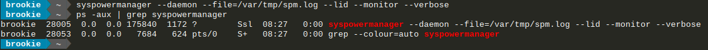

## System Power Manager
## Table of contents
- [System Power Manager](#system-power-manager)
- [Table of contents](#table-of-contents)
  - [What is System Power Manager?](#what-is-system-power-manager)
  - [What does it do?](#what-does-it-do)
  - [Why it exists?](#why-it-exists)
  - [Dependencies](#dependencies)
    - [How can I install the dependencies](#how-can-i-install-the-dependencies)
  - [Build and install](#build-and-install)
    - [Build](#build)
      - [Getting the sources](#getting-the-sources)
      - [Compilation](#compilation)
    - [Installation](#installation)
  - [Cleaning the work environment](#cleaning-the-work-environment)
  - [Run](#run)
  - [How can I use it on dwm](#how-can-i-use-it-on-dwm)
    - [Defining a constant](#defining-a-constant)
    - [Adding a keyboard shorcut for shutdown](#adding-a-keyboard-shorcut-for-shutdown)
    - [If you have a laptop computer](#if-you-have-a-laptop-computer)
      - [Define a constant](#define-a-constant)
      - [Adding a keyboard shortcut for sleeping feature](#adding-a-keyboard-shortcut-for-sleeping-feature)
  - [Command line options](#command-line-options)
  - [Keyboard shortcuts](#keyboard-shortcuts)
  - [Note](#note)
  - [Some screenshots](#some-screenshots)

### What is System Power Manager?
System Power Manager (from now SPM) as its name suggests this program aims to manage some energy options.

### What does it do?
SPM can shutdown, reboot, hibernate (if your system allows it), and suspend your computer.
Also it can monitors your battery's charge.
This latest, with the objective of putting your computer to sleep if it has 15% or less.
So, avoid that you can lose your current work.

### Why it exists?
I have developed it to use on [dwm](https://github.com/brookiestein/dwm)
since it was very heavy open a terminal, enter the root password, etc., for do
things that shouldn't give much work to perform, like e.g. shutdown or reboot the system.

**Even though I developed it for satisfy a personal need in dwm, you can use it however and wherever you want.**

### Dependencies:
```
make (for compiling)
dbus
gtk3
elogind
libnotify
```
#### How can I install the dependencies?
Depending on your Linux distribution use the corresponding command:
| Distribution                     | Command                                                                                      |
|:---------------------------------|----------------------------------------------------------------------------------------------|
|Debian/Ubuntu and derivatives     |`apt install make dbus libgtk-3-dev elogind libnotify-dev`                                    |
|Fedora/CentOS/RHEL                |`dnf install make dbus-glib gtk3-devel elogind libnotify`                                     |
|Gentoo/Funtoo and derivatives     |`emerge --ask sys-devel/make sys-apps/dbus x11-libs/gtk+ x11-libs/libnotify sys-auth/elogind` |
|Arch Linux/Manjaro and derivatives|`pacman -S make dbus gtk3 elogind libnotify`                                                  |

**Remember to execute these commands as user root**

### Build and install
#### Build
##### Getting the sources
First get the sources:
```
$ git clone https://github.com/brookiestein/syspowermanager
```
##### Compilation
After that proceed to the compilation:
```
$ make
```
### Installation
Then install:
```
# make install
```
### Cleaning the work environment
Finally clean the work environment:
```
$ make clean
```

### Run
For launching the program: execute in a console the next command:
```
$ spm
```

### How can I use it on dwm
If you want to add it as a keyboard shortcut in dwm, add this to your config.h:

#### Defining a constant
First, define a constant with the command:
```
static const char *spm[]              = { "spm", NULL };
```
Notice that using SPM without any of its parameters means that you want to use its GUI.

#### Adding a keyboard shorcut for shutdown
Then, add the keyboard shortcut and recompile your dwm:
```
static Key keys[] = {
        ...
        { 0,                            XF86XK_PowerOff,spawn,     {.v = spm } },
        ...
};
```
Basically if you press the poweroff button, located physically in your computer, SPM's GUI
will appear showing you the power options you can do with it.

### If you have a laptop computer
If you have a laptop, you may wish to add the suspend's feature it may have.
For example I have a Lenovo Thinkpad laptop and it has that feature by pressing: FN + F4.
That key combination, in an X system, is called XF86XK_Sleep, so add the following lines
to your config.h file.

#### Define a constant
As is obvious, first declare a variable (The name is indifferent):
```
static const char *suspend[]              = { "spm", "--suspend", NULL };
```

#### Adding a keyboard shortcut for sleeping feature
Then, add the keyboard shortcut:
```
static Key keys[] = {
        ...
        { 0,                            XF86XK_Sleep,spawn,     {.v = suspend } },
        ...
};
```
**With this, dwm "will simulate" the popular keyboard shortcut for suspending your computer ;-).**

### Command line options
The following command line options were added if you don't want GUI.
|Option                 | Description                                     |
|:----------------------|-------------------------------------------------|
|-d, --daemon           | Put SPM to work like a daemon.                  |
|-f, --file[=file]      | File where save a log. (Only for -v)            |
|-h, --hibernate        | Hibernate the system.                           |
|-l, --lid              | Monitors laptop's lid to suspend the system     |
|                       | when it has been closed.                        |
|-m, --monitor          | Monitor your battery's charge percentage.       |
|                       | If SPM detects that it is arrives to 15%        |
|                       | then, will suspend your computer and avoid      |
|                       | that you lose important work's data.            |
|-p, --poweroff         | Turn off the system.                            |
|-r, --restart          | Reboot the system.                              |
|-s, --suspend          | Suspend the system.                             |
|-v, --verbose          | Show the charge percentage each 30 seconds.     |
|                       | (It only works for -m option)                   |
|-w, --wait[=seconds]   | Wait for $seconds to finish before do one of    |
|                       | either hibernate, poweroff, restart or suspend. |
|-?, --help             | Give this help list.                            |
|    --usage            | Give a short usage message.                     |
|-V, --version          | Show the actual version of this program.        |

You can use these parameters for a simple and quick solution. On the other hand, 
if you want to use the GTK interface, then do not offer any parameters.

### Keyboard shortcuts
If you want to use the GUI, the following keyboard shortcuts may interest you:
|Keyboard shortcut              | Description             |
|:------------------------------|-------------------------|
|Escape                         | Closes the application. |
|p                              | Turns off the system.   |
|h                              | Hibernates the system.  |
|r                              | Reboots the system.     |
|s                              | Suspends the system.    |

### Note
Also you can declare variables for use the shortcuts by way of that you
don't need execute the GUI to perform any of the options SPM allows you to do.

How to perform it? For sure you know ;-)

### Some screenshots





